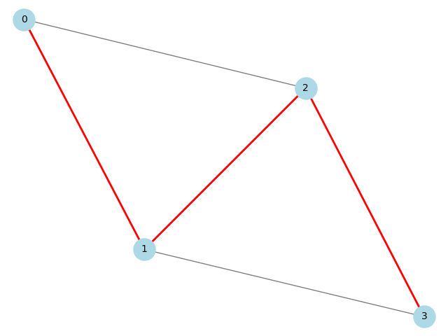

# Implementação do Algoritmo para Caminho Hamiltoniano em Python

## 📋 Descrição do Projeto
Este projeto implementa um algoritmo em Python para encontrar um Caminho Hamiltoniano em um grafo orientado ou não orientado. Um Caminho Hamiltoniano é um caminho que visita cada vértice exatamente uma vez, sem repetições.


### 🔍 Sobre o Algoritmo
O problema do Caminho Hamiltoniano é um problema clássico em teoria dos grafos, intimamente relacionado ao Problema do Caixeiro Viajante. A implementação busca determinar a existência de um caminho que visite cada vértice exatamente uma vez e, caso exista, retornar esse caminho.

## 🚀 Como Executar o Projeto

### Pré-requisitos
1. Python 3.8 ou superior
2. Bibliotecas necessárias:
   ```bash
   pip install networkx matplotlib
   ```

### Passos para Execução
1. Clone o repositório:
   ```bash
   git clone https://github.com/larisilvapedrosa/Caminho_Hamiltoniano.git
   ```
2. Acesse a pasta do projeto:
    ````bash
    cd Caminho_Hamiltoniano
    ````
2. Execute o arquivo principal:
   ```bash
   python main.py
   ```

## 💻 Explicação do Código

### main.py
```python
def is_hamiltonian_path(grafo, caminho, visitado, vertice_atual, n):
    # Verifica se o caminho atual contém todos os vértices
    if len(caminho) == n:
        return True

    # Tenta adicionar cada vizinho não visitado ao caminho
    for vizinho in grafo[vertice_atual]:
        if not visitado[vizinho]:
            visitado[vizinho] = True
            caminho.append(vizinho)

            # Recursivamente tenta completar o caminho
            if is_hamiltonian_path(grafo, caminho, visitado, vizinho, n):
                return True

            # Backtracking: remove o vértice se não levar a uma solução
            caminho.pop()
            visitado[vizinho] = False

    return False

def encontre_o_caminho_hamiltoniano(grafo):
    n = len(grafo)  

    # Tenta encontrar um caminho começando de cada vértice
    for inicio_vertice in range(n):
        visitado = [False] * n
        caminho = [inicio_vertice]
        visitado[inicio_vertice] = True

        if is_hamiltonian_path(grafo, caminho, visitado, inicio_vertice, n):
            return caminho

    return None
```

### view.py
```python
def desenhar_grafo(grafo, caminho_hamiltoniano=None, output_file="assets/grafo.png"):
    # Cria um grafo usando NetworkX
    G = nx.Graph()

    # Adiciona as arestas ao grafo
    for vertice, vizinhos in grafo.items():
        for vizinho in vizinhos:
            G.add_edge(vertice, vizinho)

    # Define o layout do grafo
    pos = nx.spring_layout(G)  
    
    # Desenha o grafo base
    nx.draw(G, pos, with_labels=True, node_color="lightblue", 
            edge_color="gray", node_size=500, font_size=10)

    # Destaca o caminho hamiltoniano se existir
    if caminho_hamiltoniano:
        edges = [(caminho_hamiltoniano[i], caminho_hamiltoniano[i + 1]) 
                for i in range(len(caminho_hamiltoniano) - 1)]
        nx.draw_networkx_edges(G, pos, edgelist=edges, edge_color="red", width=2)

    # Salva e exibe o grafo
    plt.savefig(output_file)
    plt.show()
```

## 📊 Relatório Técnico

### Análise da Complexidade Computacional

#### Classes de Complexidade
O problema do Caminho Hamiltoniano se enquadra na classe NP-Completo. Isso pode ser justificado pelos seguintes pontos:

1. **NP**: O problema pertence à classe NP porque:
   - Uma solução pode ser verificada em tempo polinomial
   - Dado um caminho, podemos facilmente verificar se ele visita cada vértice exatamente uma vez

2. **NP-Completo**: O problema é NP-Completo porque:
   - É um problema de decisão
   - Pode ser reduzido ao Problema do Caixeiro Viajante (TSP)
   - TSP é um problema NP-Completo conhecido

#### Complexidade Assintótica de Tempo
- **Pior Caso**: O(n!)
  - O algoritmo tenta todas as possíveis permutações de vértices
  - Para n vértices, existem n! possíveis caminhos

- **Caso Médio**: Entre O(n) e O(n!)
  - Mesmo no caso médio, o algoritmo precisa explorar uma grande parte do espaço de busca

- **Melhor Caso**: O(n)
  - Ocorre quando o primeiro caminho tentado é hamiltoniano
  - Raramente acontece na prática

#### Aplicabilidade do Teorema Mestre
O Teorema Mestre não pode ser aplicado neste caso porque:
1. O algoritmo não segue o padrão de divisão e conquista
2. Não possui uma relação de recorrência que se encaixe no formato do teorema
3. A complexidade é determinada pela natureza combinatória do problema

## Visualização do Grafo



